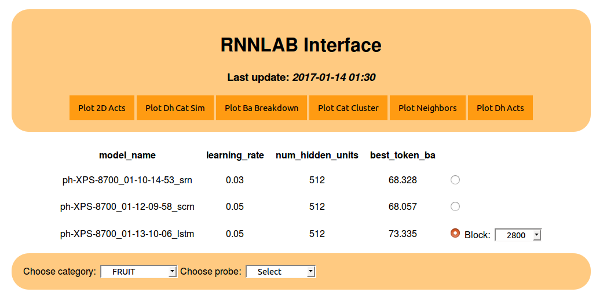
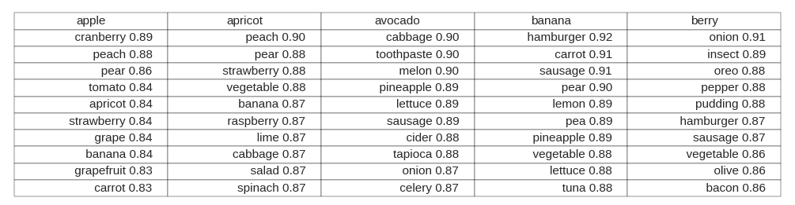

=====================================
Rnnlab
=====================================

Python API to train and analyze RNN language models using Tensorflow

Installation:
=============

Rnnlab can be installed via pypi:

``pip install rnnlab``

Before Using:
=============

In your your home directory, create **rnnlab_user_configs.csv**. A variety of training hyperparameters and other
configurations may be specified here. Not all are required. A bare-bones example:

+---------------+------------------+-------------+---------------+--------------+-----------------+
| learning_rate | num_hidden_units | bptt_steps  | corpus_name   | probes_name  | vocab_file_name |
+---------------+------------------+-------------+---------------+--------------+-----------------+
| 0.03          | 512              | 7           | childes2_3YO  | semantic     | vocab_3YO_4238  |
+---------------+------------------+-------------+---------------+--------------+-----------------+

Next, create **.rnnlabrc** and include the following inside: ::

    runs_dir <path to where you want to save model data>
    gpu <True or False depending on your setup>

That's it! You've just told rnnlab where to save model data and whether or not to use the gpu (recommended) to speed up training time.

Example Script:
===============

This script imports ``gen_user_configs`` which loads the information contained in
the configurations file created above. In combination with a ``for`` loop, multiple
configurations can be loaded for sequential training of multiple models.

We also import the ``RNN`` class, which, when instantiated, creates a Tensorflow graph of the user-specified
RNN architecture. This class contains a ``train`` ing method which is used to train the model.

``rnnlab`` comes packaged with the corpus **childes2_3YO** so that you can test your implementation right out
of the box. Just make sure you specify the name of the corpus in **rnnlab_user_configs.csv** .

.. -code-begin-

.. code-block:: pycon

   >>> from rnnlab import gen_user_configs, RNN
   >>>
   >>> for user_configs in gen_user_configs():
   >>>     myrnn = RNN('lstm', user_configs) # try 'srn', ''irnn', 'scrn'
   >>>     myrnn.train()

During training, hidden state activations for user-specified words (probes) are collected into a pandas dataframe and saved
to disk. An included browser application can visualize the data during and after training. After you have started
training a model, a bash alias will have been created for easy access to the app. Simply type ``rnnlab`` in a bash shell
and navigate to the url.

.. code-block:: pycon

    >>> rnnlab
    * Running on http://127.0.0.1:5000/ (Press CTRL+C to quit)

    This is the browser application interface where you can select a trained model and plot its data

Example of a dimensionality reduction plot produced using the browser application:

    SVD and t-SNE algorithms are used to map a trained model's hidden activation state space into 2 dimensions

    Nearest neighbors for a selection of 5 probes from the category 'fruits'

Customization
=============

If you would like to train on a different corpus, create a directory **data** in your working directory, and place a
folder with the name of the corpus inside it. Save the corpus as a .txt file (with documents separated by new lines)
inside the folder you just created and title it **corpus.txt**.

To load a custom list of probes, create
a folder named **probes** inside the data directory. Then, save a list of probes to a .txt file (each probe separated by a
new line) and make sure that the name you give it is reflected in **rnnlab_user_configs.csv**. Done!

Project Information
===================

``rnnlab`` is released under the `MIT <http://choosealicense.com/licenses/mit/>`_ license,
the code on `GitHub <https://github.com/phueb/rnnlab>`_,
and the latest release on `PyPI <https://pypi.org/project/rnnlab/>`_.
Tested on Python 2.7.
